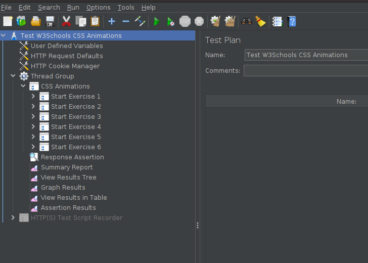

# Test Runner
- apache-jmeter-5.5/bin/jmeter.sh

# Test Plan
- File:Open: 'w3schools.jmx' in project root directory
- Expand Tree: 'Test W3Schools CSS Animations'
- Expand Tree: 'Thread Group' 
- Expand Tree: 'CSS Animations'
  
**OBSERVE TEST PLAN STRUCTURE**
  

# Test Execution
- Run:Start
- OR
- Click Green Run Arrow on Menu Bar 

# Test Results
- Viewed in Test Plan
  * Summary Report
  * View Results Tree
  * Graph Results
  * View Results in Table
  * Assertion Results

# Required
- Java 8 or higher

# Environment
- openjdk 18.0.1.1 2022-04-22
- OpenJDK Runtime Environment Homebrew (build 18.0.1.1+0)
- OpenJDK 64-Bit Server VM Homebrew (build 18.0.1.1+0, mixed mode, sharing)
